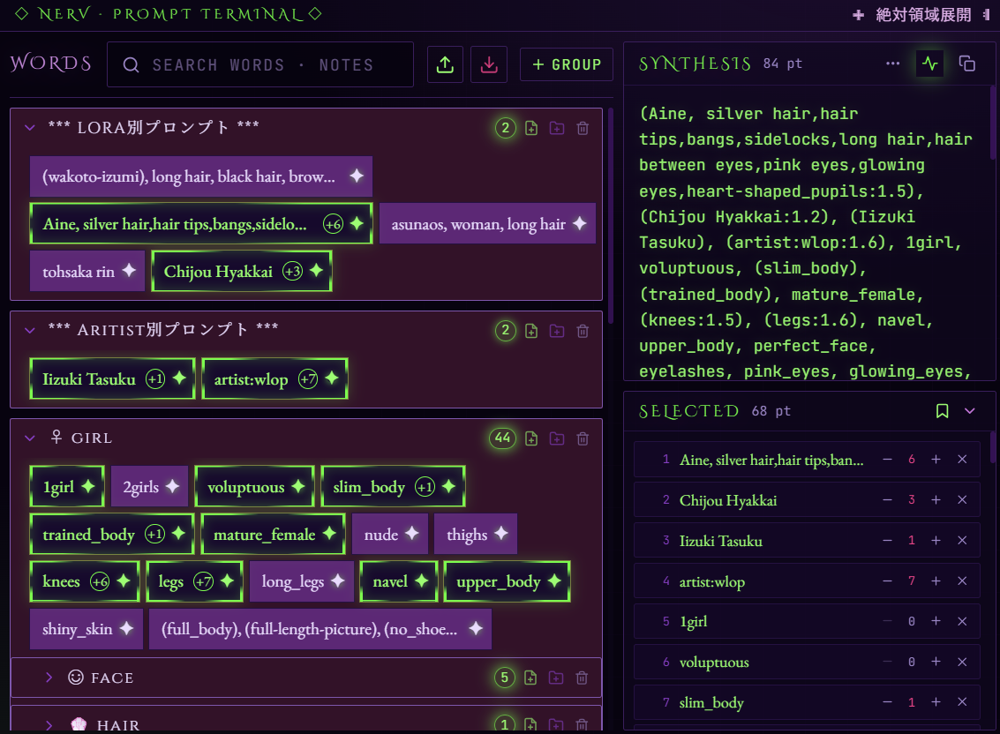
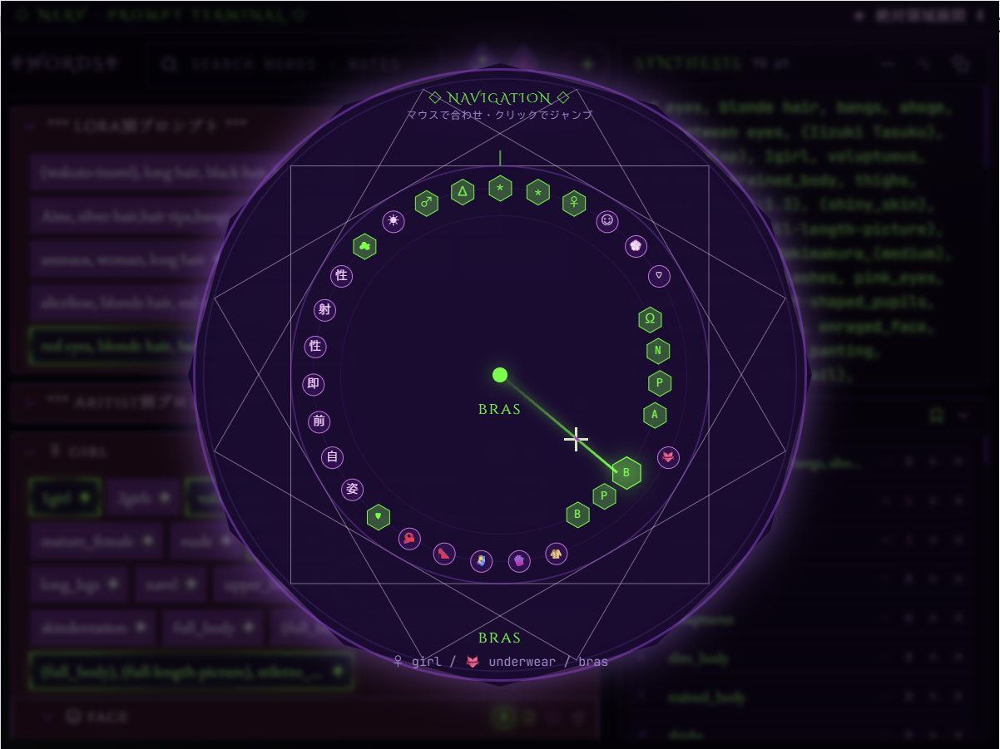

# vibe coding
- MODEL: glm 5.2
- IDE:   vscode + claude code + cc switch




# ComfyUI Prompt Recorder

エヴァンゲリオン初号機をテーマにした、ComfyUI プロンプトワード記録 Chrome 拡張機能（Manifest V3）。
プロンプトワードを階層化されたグループへ記録・選定し、重複を排除した最終プロンプトを生成する。
選択組み合わせはメタデータ付きプリセットとして保存・還元できる。

# 操作方法
- **グループ**: シングルクリック折り畳み、ダブルクリック編集、ドラッグ&ドロップ順調整＆入れ子機能。
- **ワード**: シングルクリック選択、ダブルクリック編集、ドラッグ&ドロップ順調整、ワードが選定された場合、右クリックプロンプト強度調整。
- **プリセット**: SELECTED ヘッダから保存（ブックマーク）・一覧（レイヤー）。一覧は六角形ハニカムで並替、詳細カードから還元・更新・編集・削除。

## 機能

- **ツリー状グループ**: グループは無制限にネスト可能（CHARACTER > Upper Body > Hair …）
- **ワード選択/編集**: シングルクリックで選択切替、ダブルクリックで `text` / `note` 編集
- **注釈 (note)**: ワード横の緑の印で注釈の有無を表示
- **横断検索**: ワード本文と注釈を検索し、非ヒットを淡色化
- **折り畳み**: 選択ワードを内包するグループに緑の徽章を表示
- **総括欄 (右上)**: 選択ワードを出現順に集約し、正規化で重複排除。カンマ/改行切替・クリップボードコピー。コピー基準からの差分表示
- **選択済み一覧 (右下)**: クリックで即時選択解除、強度ステッパー。ヘッダからプリセット保存・一覧を起動
- **プリセット**: 選択組み合わせ + ベースモデル / LoRA / ControlNet / 生成パラメータ / プレビュー画像を保存
  - 還元は wordId 基準（text は復元しない）。id 欠落・テキスト変更は事前警告
  - エントリ更新時は追加/削除/強度変更の差分プレビュー
  - 同名プリセットは上書きせず、フォーム側で重複名を禁止
  - 一覧は正六角形ハニカム + DnD 並替、詳細は 3D フリップカード
- **ドラッグ&ドロップ**: ワードは同一グループ内の並替、グループは並替＋他グループ内へのネスト移動
- **JSON 入出力**: アイコンのみで Import（赤紫↓）/ Export（緑↑）。Import 時はマージ確認付き。旧形式プリセットも読み込み可
- **永続化**: `chrome.storage.local` へ debounce 自動保存

## レイアウト

黄金比（1.618:1）。左 61.8% = ワード画面、右上 = 総括欄、右下 = 選択ワード一覧。
ポップアップサイズは 800×600px（Chrome popup 上限 800×600 内）。

## 技術スタック

React 19 / Vite / TypeScript / Tailwind CSS / Motion / React Icons / Manifest V3 / CRXJS Vite Plugin  

ReactCompilerは未使用

## 開発モード

```bash
npm run dev
http://localhost:5173/src/popup.html
```

## セットアップ

```bash
npm install
npm run build      # dist/ に拡張機能を出力
```

## Chrome への読み込み

1. `npm run build` を実行（`dist/` が生成される）
2. Chrome で `chrome://extensions` を開く
3. 右上「デベロッパー モード」を有効化
4. 「パッケージ化されていない拡張機能を読み込む」→ `dist/` フォルダを選択
5. ツールバーの拡張機能アイコンをクリック → ポップアップが起動

## スクリプト

| コマンド | 内容 |
|---|---|
| `npm run dev` | Vite 開発サーバ（ブラウザで UI 確認用） |
| `npm run build` | 型チェック + 本番ビルド → `dist/` |
| `npm run lint` | ESLint |

## ファイル構成

```
src/
├─ main.tsx                 # React エントリ
├─ App.tsx                  # 黄金比レイアウト + Provider 階層
├─ popup.html               # Vite 入力 HTML
├─ types.ts                 # 型定義（RootState/Group/Word/Preset）
├─ index.css                # Tailwind + EVA-01 テーマ
├─ context/
│  ├─ PromptContext.tsx     # グローバル状態 + chrome.storage 永続化
│  └─ PresetFormContext.tsx # プリセット保存・編集モーダル API
├─ components/
│  ├─ WordPanel.tsx         # 左：ワード画面統括
│  ├─ SynthesisPanel.tsx    # 右上：総括欄（重複排除・コピー）
│  ├─ SelectedPanel.tsx     # 右下：選択ワード一覧 + プリセット起動
│  ├─ GroupNode.tsx         # 再帰的グループ表示（折り畳み・DnD）
│  ├─ WordItem.tsx          # ワード行（選択/編集/強度調整/DnD）
│  ├─ SearchBox.tsx         # 検索欄（ワード本文+注釈横断）
│  ├─ IOButtons.tsx         # Import/Export アイコン
│  ├─ WordEditModal.tsx     # ワード追加・編集モーダル
│  ├─ ConfirmDialog.tsx     # 確認ダイアログ（エヴァ風デザイン）
│  ├─ ClockNav.tsx          # 時計の指針型ロードマップ
│  ├─ PresetFormModal.tsx   # プリセット保存・メタ編集フォーム
│  ├─ PresetListPanel.tsx   # プリセット一覧（ハニカム + 詳細カード）
│  ├─ preset/               # プリセット UI 部品
│  │  ├─ FormField.tsx
│  │  ├─ ImagePicker.tsx
│  │  ├─ ModelListEditor.tsx
│  │  ├─ NumField.tsx       # EVA風カスタムステッパー
│  │  ├─ PresetHexTile.tsx
│  │  ├─ HexDragGhost.tsx
│  │  ├─ PresetDetailCard.tsx
│  │  └─ UpdateDiffBody.tsx # エントリ更新時の差分表示
│  └─ synthesis/            # 総括欄の差分 UI
│     ├─ DiffPopup.tsx
│     ├─ DiffSection.tsx
│     └─ countSynthesisPoints.ts
├─ hooks/
│  ├─ useClickOutside.tsx
│  ├─ useEscapeKey.tsx
│  ├─ useSynthesisCopy.tsx
│  ├─ usePresetFormState.tsx
│  ├─ usePresetHexDnD.tsx
│  └─ usePresetListActions.tsx
└─ lib/
   ├─ tree.ts               # ツリー操作（全モジュールを再エクスポート）
   ├─ tree/                 # ツリー操作モジュール（SRP分割）
   │  ├─ id.ts              # ID生成
   │  ├─ factory.ts         # オブジェクト生成
   │  ├─ search.ts          # ツリー検索
   │  ├─ immutable.ts       # immutable更新ヘルパ
   │  ├─ group.ts           # グループ操作
   │  ├─ word.ts            # ワード操作
   │  ├─ collector.ts       # 選択ワード収集
   │  ├─ navigation.ts      # グループ列挙・展開
   │  ├─ preset.ts          # プリセット操作（保存/還元/差分/並替）
   │  └─ normalize.ts       # Import/Export正規化
   ├─ normalize.ts          # 重複判定（trim+小文字化+空白圧縮）
   ├─ strength.ts           # 強度調整（0..10 → ()/(text:1.x)）
   ├─ diff.ts               # 差分検出（追加/削除/強度変更）
   ├─ image.ts              # 画像圧縮（ワード420px / プリセット560px）
   ├─ array.ts              # 配列ユーティリティ
   ├─ storage.ts            # chrome.storage ラッパ + debounce
   └─ motions.ts            # Motion用アニメーション定義
public/
├─ manifest.json            # Chrome拡張機能マニフェスト（V3）
├─ icons/                   # アイコン画像（16/32/48/128px）
└─ images/                  # UI用背景画像（PresetPanelBg 等）
```
